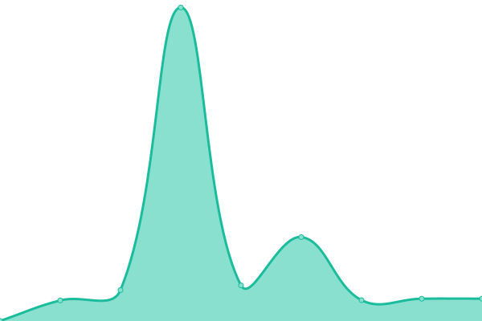
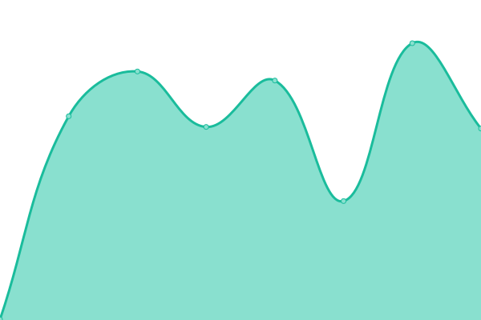
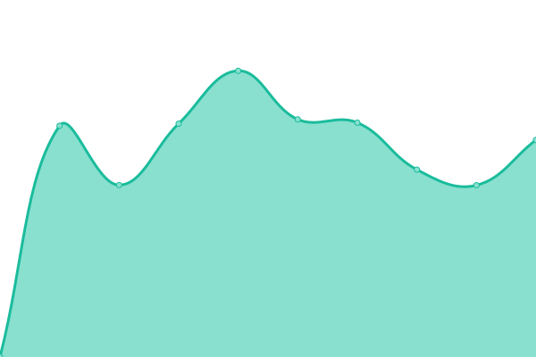

# [📈 Live Status](https://uptime.eplus.dev): <!--live status--> **🟩 All systems operational**

This repository contains the open-source uptime monitor and status page for [David Nguyen](eplus.dev), powered by [Upptime](https://github.com/upptime/upptime).

With [Upptime](https://upptime.js.org), you can get your own unlimited and free uptime monitor and status page, powered entirely by a GitHub repository. We use [Issues](https://github.com/hoangsvit/uptime/issues) as incident reports, [Actions](https://github.com/hoangsvit/uptime/actions) as uptime monitors, and [Pages](https://uptime.eplus.dev) for the status page.

<!--start: status pages-->
<!-- This summary is generated by Upptime (https://github.com/upptime/upptime) -->
<!-- Do not edit this manually, your changes will be overwritten -->
<!-- prettier-ignore -->
| URL | Status | History | Response Time | Uptime |
| --- | ------ | ------- | ------------- | ------ |
|  [ePlus.DEV](https://eplus.dev) | 🟩 Up | [e-plus-dev.yml](https://github.com/hoangsvit/uptime/commits/HEAD/history/e-plus-dev.yml) | 

 173ms
     
 | 

<a href="https://uptime.eplus.dev/history/e-plus-dev">100.00%</a>
    

|  [ePlus Radio](https://radio.eplus.dev) | 🟩 Up | [e-plus-radio.yml](https://github.com/hoangsvit/uptime/commits/HEAD/history/e-plus-radio.yml) | 

 137ms
     
 | 

<a href="https://uptime.eplus.dev/history/e-plus-radio">100.00%</a>
    

|  [ePlus Forum](https://forum.eplus.dev) | 🟩 Up | [e-plus-forum.yml](https://github.com/hoangsvit/uptime/commits/HEAD/history/e-plus-forum.yml) | 

 617ms
     
 | 

<a href="https://uptime.eplus.dev/history/e-plus-forum">99.77%</a>
    

|  [Graphql Studio](https://graphql-studio.eplus.dev) | 🟩 Up | [graphql-studio.yml](https://github.com/hoangsvit/uptime/commits/HEAD/history/graphql-studio.yml) | 

 101ms
     
 | 

<a href="https://uptime.eplus.dev/history/graphql-studio">100.00%</a>
    

|  [ePlus Analytics](https://analytics.eplus.dev) | 🟩 Up | [e-plus-analytics.yml](https://github.com/hoangsvit/uptime/commits/HEAD/history/e-plus-analytics.yml) | 

 305ms
     
 | 

<a href="https://uptime.eplus.dev/history/e-plus-analytics">100.00%</a>
    

|  [ePlus JSON Crack](https://json.eplus.dev) | 🟩 Up | [e-plus-json-crack.yml](https://github.com/hoangsvit/uptime/commits/HEAD/history/e-plus-json-crack.yml) | 

 125ms
     
 | 

<a href="https://uptime.eplus.dev/history/e-plus-json-crack">100.00%</a>
    

|  [ePlus Cors Anywhere](https://cors-anywhere.eplus.dev) | 🟩 Up | [e-plus-cors-anywhere.yml](https://github.com/hoangsvit/uptime/commits/HEAD/history/e-plus-cors-anywhere.yml) | 

 113ms
     
 | 

<a href="https://uptime.eplus.dev/history/e-plus-cors-anywhere">100.00%</a>
    

|  [ePlus Auth](https://auth.eplus.dev/dashboard/) | 🟩 Up | [e-plus-auth.yml](https://github.com/hoangsvit/uptime/commits/HEAD/history/e-plus-auth.yml) | 

 223ms
     
 | 

<a href="https://uptime.eplus.dev/history/e-plus-auth">100.00%</a>
    

|  [Hỗ trợ hệ thống MWG](https://mwg.eplus.dev) | 🟩 Up | [ho-tro-he-thong-mwg.yml](https://github.com/hoangsvit/uptime/commits/HEAD/history/ho-tro-he-thong-mwg.yml) | 

 113ms
     
 | 

<a href="https://uptime.eplus.dev/history/ho-tro-he-thong-mwg">100.00%</a>
    

|  [ePlus ZingMP3](https://zing.eplus.dev) | 🟩 Up | [e-plus-zing-mp-3.yml](https://github.com/hoangsvit/uptime/commits/HEAD/history/e-plus-zing-mp-3.yml) | 

 687ms
     
 | 

<a href="https://uptime.eplus.dev/history/e-plus-zing-mp-3">100.00%</a>
    

|  [ePlus HUB](https://hub.eplus.dev) | 🟩 Up | [e-plus-hub.yml](https://github.com/hoangsvit/uptime/commits/HEAD/history/e-plus-hub.yml) | 

 156ms
     
 | 

<a href="https://uptime.eplus.dev/history/e-plus-hub">100.00%</a>
    

|  [ePlus Uptime](https://uptime.eplus.dev) | 🟩 Up | [e-plus-uptime.yml](https://github.com/hoangsvit/uptime/commits/HEAD/history/e-plus-uptime.yml) | 

 93ms
     
 | 

<a href="https://uptime.eplus.dev/history/e-plus-uptime">100.00%</a>
    

|  [ePlus Status](https://status.eplus.dev) | 🟩 Up | [e-plus-status.yml](https://github.com/hoangsvit/uptime/commits/HEAD/history/e-plus-status.yml) | 

 245ms
     
 | 

<a href="https://uptime.eplus.dev/history/e-plus-status">100.00%</a>
    

|  [ePlus Show Code](https://code.eplus.dev) | 🟩 Up | [e-plus-show-code.yml](https://github.com/hoangsvit/uptime/commits/HEAD/history/e-plus-show-code.yml) | 

 107ms
     
 | 

<a href="https://uptime.eplus.dev/history/e-plus-show-code">100.00%</a>
    

|  [David ❤️ Sam](https://david-sam.tech) | 🟩 Up | [david-sam.yml](https://github.com/hoangsvit/uptime/commits/HEAD/history/david-sam.yml) | 

 1528ms
     
 | 

<a href="https://uptime.eplus.dev/history/david-sam">100.00%</a>
    

|  [David ❤️ Sam (Backup)](https://dev-david-sam.pantheonsite.io) | 🟩 Up | [david-sam-backup.yml](https://github.com/hoangsvit/uptime/commits/HEAD/history/david-sam-backup.yml) | 

 2397ms
     
 | 

<a href="https://uptime.eplus.dev/history/david-sam-backup">100.00%</a>
    

|  [🍄 Nấm Nông Lâm](https://namnonglam.edu.vn) | 🟩 Up | [nam-nong-lam.yml](https://github.com/hoangsvit/uptime/commits/HEAD/history/nam-nong-lam.yml) | 

 1232ms
     
 | 

<a href="https://uptime.eplus.dev/history/nam-nong-lam">100.00%</a>
    

|  [Laravel 10x on Render](https://laravel-10x.onrender.com) | 🟩 Up | [laravel-10x-on-render.yml](https://github.com/hoangsvit/uptime/commits/HEAD/history/laravel-10x-on-render.yml) | 

 581ms
     
 | 

<a href="https://uptime.eplus.dev/history/laravel-10x-on-render">100.00%</a>
    

<!--end: status pages-->

[**Visit our status website →**](https://uptime.eplus.dev)

## 📄 License

- Powered by: [Upptime](https://github.com/upptime/upptime)
- Code: [MIT](./LICENSE) © [David Nguyen](eplus.dev)
- Data in the `./history` directory: [Open Database License](https://opendatacommons.org/licenses/odbl/1-0/)
