# [📈 Live Status](https://uptime.eplus.dev): <!--live status--> **🟩 All systems operational**

This repository contains the open-source uptime monitor and status page for [David Nguyen](eplus.dev), powered by [Upptime](https://github.com/upptime/upptime).

With [Upptime](https://upptime.js.org), you can get your own unlimited and free uptime monitor and status page, powered entirely by a GitHub repository. We use [Issues](https://github.com/hoangsvit/uptime/issues) as incident reports, [Actions](https://github.com/hoangsvit/uptime/actions) as uptime monitors, and [Pages](https://uptime.eplus.dev) for the status page.

<!--start: status pages-->
<!-- This summary is generated by Upptime (https://github.com/upptime/upptime) -->
<!-- Do not edit this manually, your changes will be overwritten -->
<!-- prettier-ignore -->
| URL | Status | History | Response Time | Uptime |
| --- | ------ | ------- | ------------- | ------ |
|  [ePlus.DEV](https://eplus.dev/api/status) | 🟩 Up | [e-plus-dev.yml](https://github.com/hoangsvit/uptime/commits/HEAD/history/e-plus-dev.yml) | 

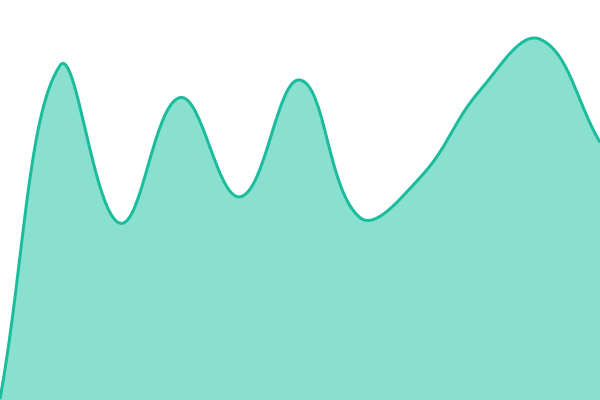 395ms
     
 | 

<a href="https://uptime.eplus.dev/history/e-plus-dev">100.00%</a>
    

|  [ePlus Radio](https://radio.eplus.dev) | 🟩 Up | [e-plus-radio.yml](https://github.com/hoangsvit/uptime/commits/HEAD/history/e-plus-radio.yml) | 

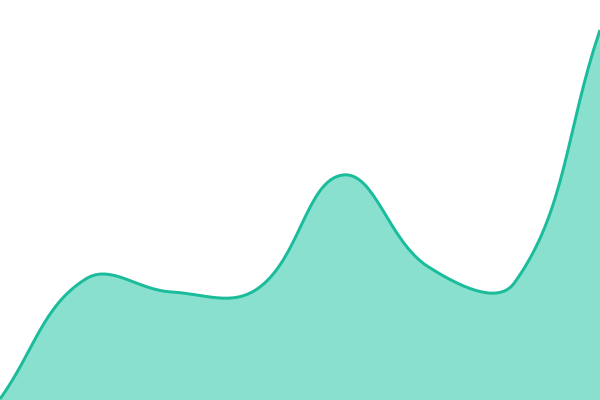 245ms
     
 | 

<a href="https://uptime.eplus.dev/history/e-plus-radio">100.00%</a>
    

|  [ePlus Radio (New)](https://new-radio.eplus.dev) | 🟩 Up | [e-plus-radio-new.yml](https://github.com/hoangsvit/uptime/commits/HEAD/history/e-plus-radio-new.yml) | 

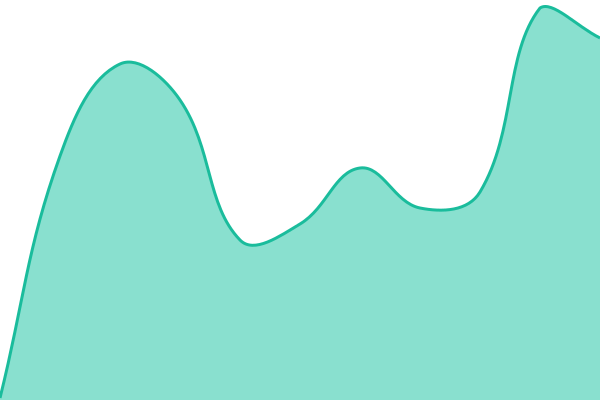 291ms
     
 | 

<a href="https://uptime.eplus.dev/history/e-plus-radio-new">100.00%</a>
    

|  [Xe](https://xe.eplus.dev) | 🟩 Up | [xe.yml](https://github.com/hoangsvit/uptime/commits/HEAD/history/xe.yml) | 

 214ms
     
 | 

<a href="https://uptime.eplus.dev/history/xe">100.00%</a>
    

|  [ePlus News](https://news.eplus.dev) | 🟩 Up | [e-plus-news.yml](https://github.com/hoangsvit/uptime/commits/HEAD/history/e-plus-news.yml) | 

 234ms
     
 | 

<a href="https://uptime.eplus.dev/history/e-plus-news">100.00%</a>
    

|  [ePlus - Top GitHub Users](https://top-github-users.eplus.dev) | 🟩 Up | [e-plus-top-git-hub-users.yml](https://github.com/hoangsvit/uptime/commits/HEAD/history/e-plus-top-git-hub-users.yml) | 

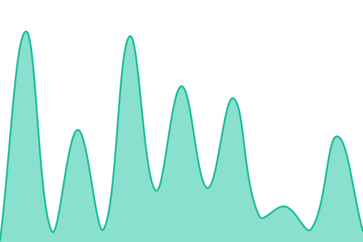 136ms
     
 | 

<a href="https://uptime.eplus.dev/history/e-plus-top-git-hub-users">100.00%</a>
    

|  [ePlus - Top GitHub](https://top-github.eplus.dev) | 🟩 Up | [e-plus-top-git-hub.yml](https://github.com/hoangsvit/uptime/commits/HEAD/history/e-plus-top-git-hub.yml) | 

 173ms
     
 | 

<a href="https://uptime.eplus.dev/history/e-plus-top-git-hub">100.00%</a>
    

|  [ePlus - Free For Dev](https://free-for-dev.eplus.dev) | 🟩 Up | [e-plus-free-for-dev.yml](https://github.com/hoangsvit/uptime/commits/HEAD/history/e-plus-free-for-dev.yml) | 

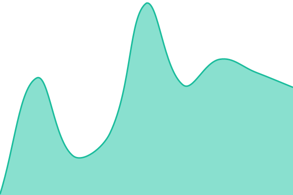 179ms
     
 | 

<a href="https://uptime.eplus.dev/history/e-plus-free-for-dev">100.00%</a>
    

|  [Graphql Studio](https://graphql-studio.eplus.dev) | 🟩 Up | [graphql-studio.yml](https://github.com/hoangsvit/uptime/commits/HEAD/history/graphql-studio.yml) | 

 174ms
     
 | 

<a href="https://uptime.eplus.dev/history/graphql-studio">100.00%</a>
    

|  [ePlus Analytics](https://analytics.eplus.dev) | 🟩 Up | [e-plus-analytics.yml](https://github.com/hoangsvit/uptime/commits/HEAD/history/e-plus-analytics.yml) | 

 3504ms
     
 | 

<a href="https://uptime.eplus.dev/history/e-plus-analytics">100.00%</a>
    

|  [ePlus JSON Crack](https://json.eplus.dev) | 🟩 Up | [e-plus-json-crack.yml](https://github.com/hoangsvit/uptime/commits/HEAD/history/e-plus-json-crack.yml) | 

 916ms
     
 | 

<a href="https://uptime.eplus.dev/history/e-plus-json-crack">100.00%</a>
    

|  [ePlus JSON Crack Plus](https://jsoncrack.eplus.dev) | 🟩 Up | [e-plus-json-crack-plus.yml](https://github.com/hoangsvit/uptime/commits/HEAD/history/e-plus-json-crack-plus.yml) | 

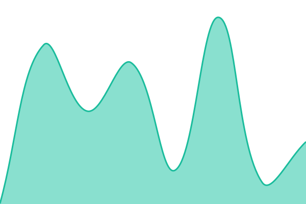 195ms
     
 | 

<a href="https://uptime.eplus.dev/history/e-plus-json-crack-plus">100.00%</a>
    

|  [ePlus AirDrop](https://air.eplus.dev) | 🟩 Up | [e-plus-air-drop.yml](https://github.com/hoangsvit/uptime/commits/HEAD/history/e-plus-air-drop.yml) | 

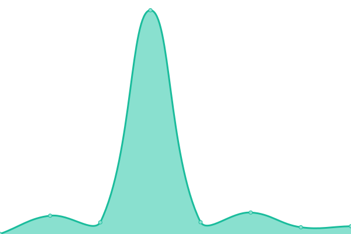 289ms
     
 | 

<a href="https://uptime.eplus.dev/history/e-plus-air-drop">100.00%</a>
    

|  [Hỗ trợ hệ thống MWG](https://mwg.eplus.dev) | 🟩 Up | [ho-tro-he-thong-mwg.yml](https://github.com/hoangsvit/uptime/commits/HEAD/history/ho-tro-he-thong-mwg.yml) | 

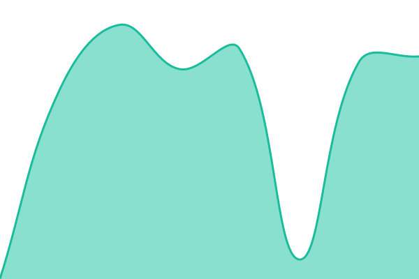 753ms
     
 | 

<a href="https://uptime.eplus.dev/history/ho-tro-he-thong-mwg">100.00%</a>
    

|  [ePlus Top GitHub Users](https://top-github-users.eplus.dev) | 🟩 Up | [e-plus-top-git-hub-users.yml](https://github.com/hoangsvit/uptime/commits/HEAD/history/e-plus-top-git-hub-users.yml) | 

 136ms
     
 | 

<a href="https://uptime.eplus.dev/history/e-plus-top-git-hub-users">100.00%</a>
    

|  [ePlus ZingMP3](https://zing.eplus.dev) | 🟩 Up | [e-plus-zing-mp-3.yml](https://github.com/hoangsvit/uptime/commits/HEAD/history/e-plus-zing-mp-3.yml) | 

 720ms
     
 | 

<a href="https://uptime.eplus.dev/history/e-plus-zing-mp-3">100.00%</a>
    

|  [ePlus DEV Tools](https://tools.eplus.dev) | 🟩 Up | [e-plus-dev-tools.yml](https://github.com/hoangsvit/uptime/commits/HEAD/history/e-plus-dev-tools.yml) | 

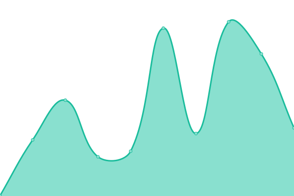 657ms
     
 | 

<a href="https://uptime.eplus.dev/history/e-plus-dev-tools">100.00%</a>
    

|  [ePlus Markdown](https://markdown.eplus.dev) | 🟩 Up | [e-plus-markdown.yml](https://github.com/hoangsvit/uptime/commits/HEAD/history/e-plus-markdown.yml) | 

 162ms
     
 | 

<a href="https://uptime.eplus.dev/history/e-plus-markdown">100.00%</a>
    

|  [ePlus Draw](https://draw.eplus.dev) | 🟩 Up | [e-plus-draw.yml](https://github.com/hoangsvit/uptime/commits/HEAD/history/e-plus-draw.yml) | 

 760ms
     
 | 

<a href="https://uptime.eplus.dev/history/e-plus-draw">100.00%</a>
    

|  [ePlus Dashboard](https://dashboard.eplus.dev) | 🟩 Up | [e-plus-dashboard.yml](https://github.com/hoangsvit/uptime/commits/HEAD/history/e-plus-dashboard.yml) | 

 805ms
     
 | 

<a href="https://uptime.eplus.dev/history/e-plus-dashboard">100.00%</a>
    

|  [ePlus CDN](https://cdn.eplus.dev) | 🟩 Up | [e-plus-cdn.yml](https://github.com/hoangsvit/uptime/commits/HEAD/history/e-plus-cdn.yml) | 

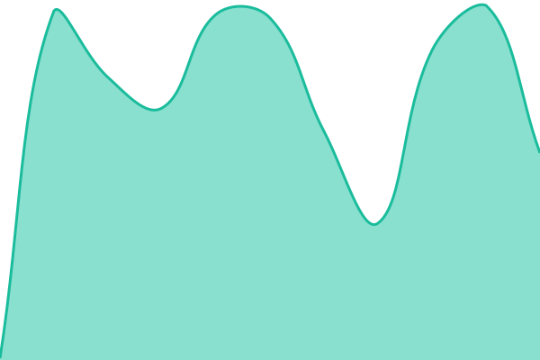 139ms
     
 | 

<a href="https://uptime.eplus.dev/history/e-plus-cdn">100.00%</a>
    

|  [ePlus Blog (Blogger)](https://blog.eplus.dev) | 🟩 Up | [e-plus-blog-blogger.yml](https://github.com/hoangsvit/uptime/commits/HEAD/history/e-plus-blog-blogger.yml) | 

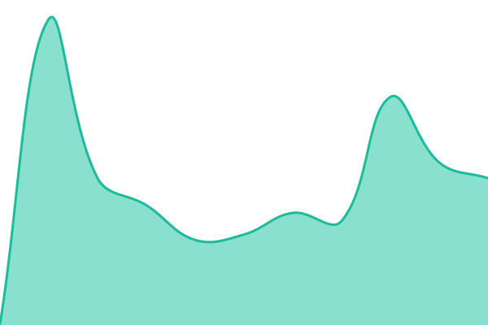 259ms
     
 | 

<a href="https://uptime.eplus.dev/history/e-plus-blog-blogger">100.00%</a>
    

|  [ePlus Laravel Artisan](https://artisan.eplus.dev) | 🟩 Up | [e-plus-laravel-artisan.yml](https://github.com/hoangsvit/uptime/commits/HEAD/history/e-plus-laravel-artisan.yml) | 

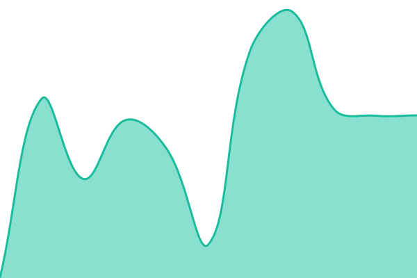 1969ms
     
 | 

<a href="https://uptime.eplus.dev/history/e-plus-laravel-artisan">100.00%</a>
    

|  [ePlus updown](https://updown.eplus.dev) | 🟩 Up | [e-plus-updown.yml](https://github.com/hoangsvit/uptime/commits/HEAD/history/e-plus-updown.yml) | 

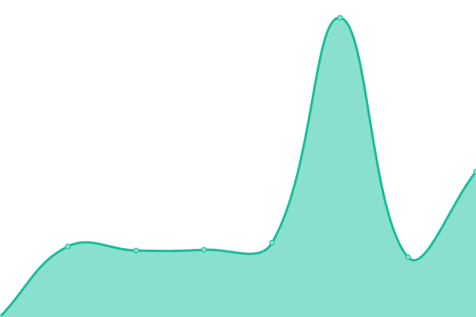 889ms
     
 | 

<a href="https://uptime.eplus.dev/history/e-plus-updown">100.00%</a>
    

|  [ePlus HUB](https://hub.eplus.dev/api/ping) | 🟩 Up | [e-plus-hub.yml](https://github.com/hoangsvit/uptime/commits/HEAD/history/e-plus-hub.yml) | 

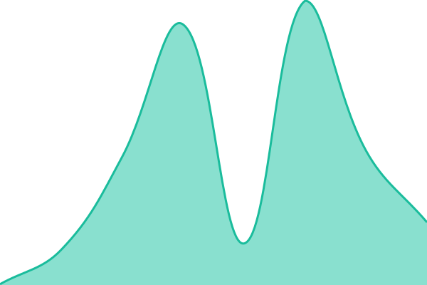 316ms
     
 | 

<a href="https://uptime.eplus.dev/history/e-plus-hub">100.00%</a>
    

|  [ePlus Uptime](https://uptime.eplus.dev) | 🟩 Up | [e-plus-uptime.yml](https://github.com/hoangsvit/uptime/commits/HEAD/history/e-plus-uptime.yml) | 

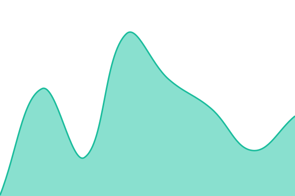 125ms
     
 | 

<a href="https://uptime.eplus.dev/history/e-plus-uptime">100.00%</a>
    

|  [ePlus Status](https://status.eplus.dev) | 🟩 Up | [e-plus-status.yml](https://github.com/hoangsvit/uptime/commits/HEAD/history/e-plus-status.yml) | 

 442ms
     
 | 

<a href="https://uptime.eplus.dev/history/e-plus-status">100.00%</a>
    

|  [ePlus Show Code](https://code.eplus.dev) | 🟩 Up | [e-plus-show-code.yml](https://github.com/hoangsvit/uptime/commits/HEAD/history/e-plus-show-code.yml) | 

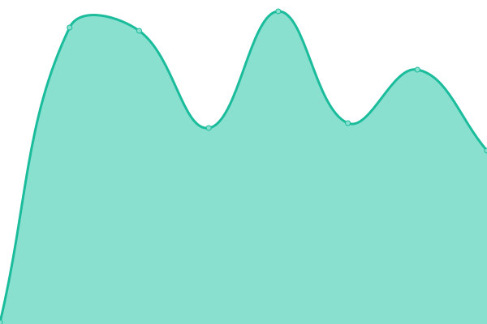 138ms
     
 | 

<a href="https://uptime.eplus.dev/history/e-plus-show-code">100.00%</a>
    

|  [ePlus Cronjob](https://cronjob.eplus.dev) | 🟩 Up | [e-plus-cronjob.yml](https://github.com/hoangsvit/uptime/commits/HEAD/history/e-plus-cronjob.yml) | 

 673ms
     
 | 

<a href="https://uptime.eplus.dev/history/e-plus-cronjob">100.00%</a>
    

|  [ePlus Drawd DB](https://drawdb.eplus.dev) | 🟩 Up | [e-plus-drawd-db.yml](https://github.com/hoangsvit/uptime/commits/HEAD/history/e-plus-drawd-db.yml) | 

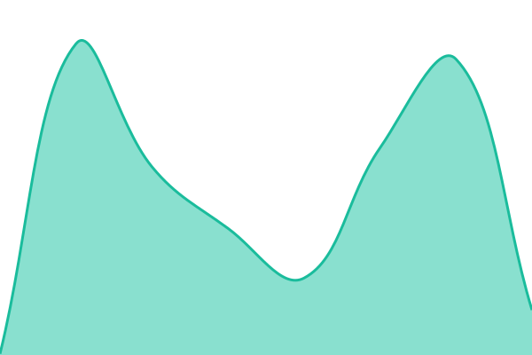 229ms
     
 | 

<a href="https://uptime.eplus.dev/history/e-plus-drawd-db">100.00%</a>
    

|  [ePlus TimeSheet](https://timesheet.eplus.dev) | 🟩 Up | [e-plus-time-sheet.yml](https://github.com/hoangsvit/uptime/commits/HEAD/history/e-plus-time-sheet.yml) | 

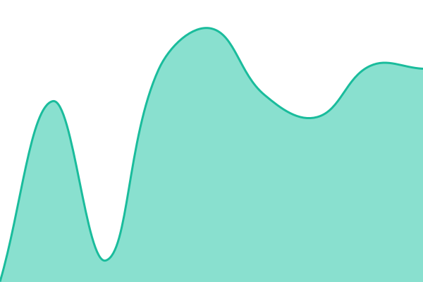 555ms
     
 | 

<a href="https://uptime.eplus.dev/history/e-plus-time-sheet">100.00%</a>
    

|  [ePlus Metrics](https://metrics.eplus.dev) | 🟩 Up | [e-plus-metrics.yml](https://github.com/hoangsvit/uptime/commits/HEAD/history/e-plus-metrics.yml) | 

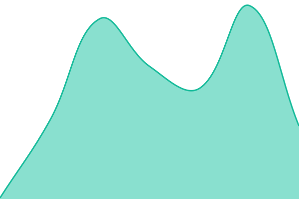 129ms
     
 | 

<a href="https://uptime.eplus.dev/history/e-plus-metrics">100.00%</a>
    

|  [ePlus Radio (old)](https://old-radio.eplus.dev) | 🟩 Up | [e-plus-radio-old.yml](https://github.com/hoangsvit/uptime/commits/HEAD/history/e-plus-radio-old.yml) | 

 504ms
     
 | 

<a href="https://uptime.eplus.dev/history/e-plus-radio-old">100.00%</a>
    

|  [David ❤️ Sam (Backup)](https://dev-david-sam.pantheonsite.io) | 🟩 Up | [david-sam-backup.yml](https://github.com/hoangsvit/uptime/commits/HEAD/history/david-sam-backup.yml) | 

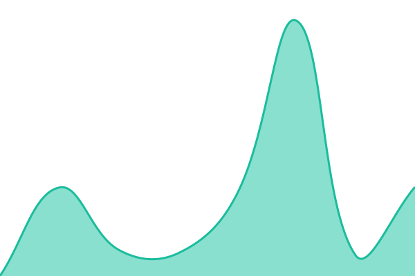 4246ms
     
 | 

<a href="https://uptime.eplus.dev/history/david-sam-backup">100.00%</a>
    

|  [🍄 Nấm Nông Lâm](https://namnonglam.edu.vn) | 🟩 Up | [nam-nong-lam.yml](https://github.com/hoangsvit/uptime/commits/HEAD/history/nam-nong-lam.yml) | 

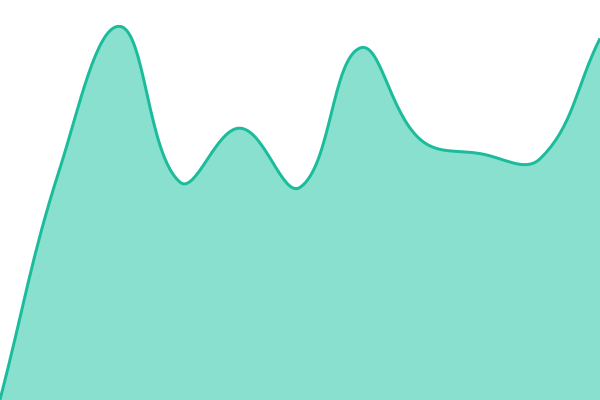 1310ms
     
 | 

<a href="https://uptime.eplus.dev/history/nam-nong-lam">100.00%</a>
    

|  [Laravel 10x on Render](https://laravel-10x.onrender.com) | 🟩 Up | [laravel-10x-on-render.yml](https://github.com/hoangsvit/uptime/commits/HEAD/history/laravel-10x-on-render.yml) | 

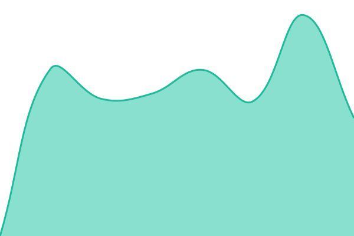 9114ms
     
 | 

<a href="https://uptime.eplus.dev/history/laravel-10x-on-render">95.03%</a>
    

<!--end: status pages-->

[**Visit our status website →**](https://uptime.eplus.dev)

## 📄 License

- Powered by: [Upptime](https://github.com/upptime/upptime)
- Code: [MIT](./LICENSE) © [David Nguyen](eplus.dev)
- Data in the `./history` directory: [Open Database License](https://opendatacommons.org/licenses/odbl/1-0/)
